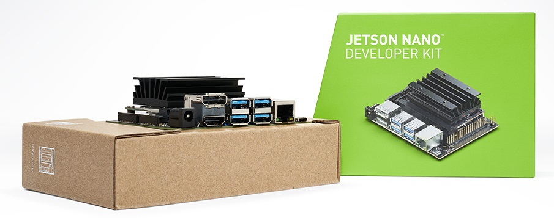

# Jetson-Nano-Object-Detection-Learn
Resource Belajar Deep Learning Object Detection di Jetson Nano

- Pertemuan 1 (Intro Jetson Nano, L4T OS, JetPack SDK, Basic GPIO Programming & Camera Intefacing)
    - [download materi (zip)](https://github.com/Muhammad-Yunus/Jetson-Nano-Object-Detection-Learn/raw/main/pertemuan_1/pertemuan_1.zip)

- Pertemuan 2 (Intro Object Detection, R-CNN, Fast R-CNN, Faster R-CNN, and Faster R-CNN inferencing using OpenCV DNN & Tensorflow 2.0)
    - [download materi (zip)](https://github.com/Muhammad-Yunus/Jetson-Nano-Object-Detection-Learn/raw/main/pertemuan_2/pertemuan_2.zip)

- Pertemuan 3 (Prepare Object Detection Dataset, Train Faster R-CNN with Custom Dataset, & Deploy model to Jetson Nano)
    - [download materi (zip)](https://github.com/Muhammad-Yunus/Jetson-Nano-Object-Detection-Learn/raw/main/pertemuan_3/pertemuan_3.zip)
    - [download ObjectDetection-Tensorflow repo (zip)](https://github.com/Muhammad-Yunus/ObjectDetection-Tensorflow/archive/main.zip)
    - [download labelImg (zip)](https://github.com/tzutalin/labelImg/archive/master.zip)

- Pertemuan 4 (Intro to Yolo Object Detection, Train Yolo using Darknet Framework with Custom Dataset, & Deploy model to Jetson Nano)
    - [download materi (zip)](https://github.com/Muhammad-Yunus/Jetson-Nano-Object-Detection-Learn/raw/main/pertemuan_4/pertemuan_4.zip)
    - [download ObjectDetection-Yolo repo (zip)](https://github.com/Muhammad-Yunus/ObjectDetection-Yolo/archive/master.zip)
    - [download labelImg (zip)](https://github.com/tzutalin/labelImg/archive/master.zip)