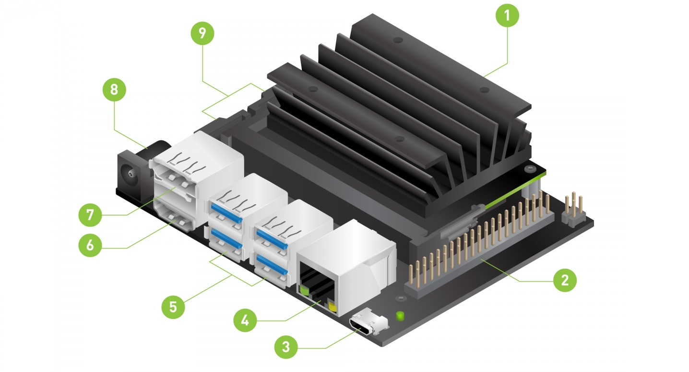
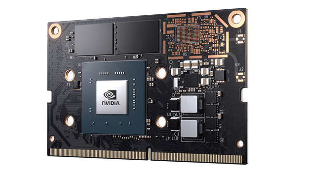
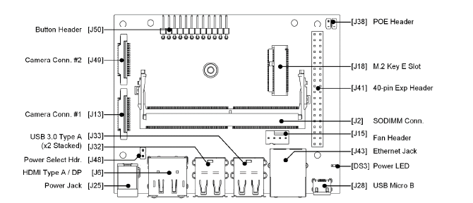
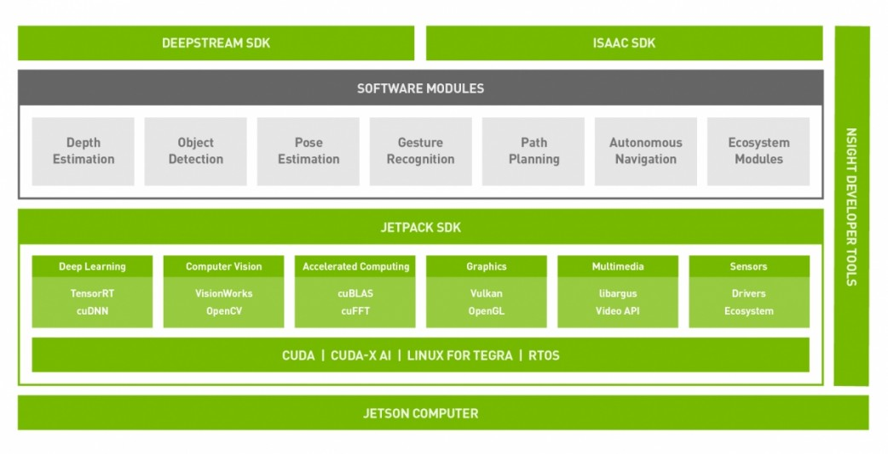

# Pertemuan 1
- Intro to Jetson-nano, L4T (Linux for Tegra) & JetPack,  
- GPIO Programming & Hardware interfacing (Buzzer & LED)
- Camera interfacing,

___
## Jetson-nano

- NVIDIA® Jetson Nano™ Developer Kit is a small, powerful computer that lets you run multiple neural networks in parallel, easy-to-use platform that runs in as little as 5 watts.
- Feature :
    - Jetson Nano Module
    
        - 128-core NVIDIA Maxwell™ GPU
        - Quad-core ARM® A57 CPU
        - 4 GB 64-bit LPDDR4
        - 10/100/1000BASE-T Ethernet 
     - Power Options
        - Micro-USB 5V 2A
        - DC power adapter 5V 4A
    -  I/O
    
    *Jetson Nano B01*   
        - USB 3.0 Type A
        - USB 2.0 Micro-B 
        - HDMI/DisplayPort
        - M.2 Key E
        - Gigabit Ethernet
        - GPIOs, I2C, I2S, SPI, UART
        - 2xMIPI-CSI camera connector
        - Fan connector
        - PoE connector
___

## L4T OS (Linux For Tegra)
- Linux for Tegra (Linux4Tegra, L4T) is a GNU/Linux based system software distribution by Nvidia for the Nvidia Tegra processor series, used in platforms like the Nvidia Jetson board series. [[wiki](https://en.wikipedia.org/wiki/Linux_for_Tegra)]
- It includes :
    - Linux Kernel 4.9, 
    - bootloader, 
    - NVIDIA drivers, 
    - flashing utilities, 
    - sample filesystem based on Ubuntu 18.04, 
    - and more for the Jetson platform
- Latest release is NVIDIA L4T 32.5, supports all Jetson modules: 
    - Jetson AGX Xavier series, 
    - Jetson Xavier NX, 
    - Jetson TX2 series, 
    - Jetson TX1, 
    - and Jetson Nano
- Check L4T version used by Jetson Nano using Terminal
    ```
    head -n 1 /etc/nv_tegra_release
    ```
- Result :
    ```
    # R32 (release), REVISION: 5.0, GCID: 25531747, BOARD: t210ref, EABI: aarch64, DATE: Fri Jan 15 22:55:35 UTC 2021
    ```
- `R32` and `REVISION: 5.0` in the log above indicates that the L4T version used is L4T 32.5.
- Check L4T Linux Kernel version,
    ```
    uname -a
    ```
- Result,
    ```
    Linux jetson 4.9.201-tegra #1 SMP PREEMPT Fri Jan 15 14:41:02 PST 2021 aarch64 aarch64 aarch64 GNU/Linux
    ```
- You can see that the kernel version used is `4.9.201-tegra` for the `aarch64` architecture.
___
## NVIDIA JetPack
- NVIDIA JetPack SDK is the most comprehensive solution for building AI applications. All Jetson modules and developer kits are supported by JetPack SDK.
- JetPack SDK includes the latest Linux Driver Package (L4T) with Linux operating system and CUDA-X accelerated libraries and APIs for Deep Learning, Computer Vision, Accelerated Computing and Multimedia. 

- Latest release JetPack is version 4.5.
- JetPack Feature :
    - **OS** : NVIDIA L4T (JetPack 4.5 includes L4T 32.5)
    - **CUDA** : is a parallel computing platform and programming model using a GPU. (JetPack 4.5 include CUDA 10.2 )
    - **cuDNN** : (CUDA Deep Neural Network) is a GPU-accelerated library of primitives for deep neural networks. Provides highly tuned implementations for standard routines such as *forward* and *backward convolution*, *pooling*, *normalization*, and *activation layers*. cuDNN accelerates widely used deep learning frameworks, including **Caffe2**, **Chainer**, **Keras**, **MATLAB**, **MxNet**, **PaddlePaddle**, **PyTorch**, and **TensorFlow** (JetPack 4.5 includes cuDNN 8.0).
    - **TensorRT** : is a high performance deep learning inference runtime, built on top of CUDA (JetPack 4.5 includes TensorRT 7.1.3)
    - **Computer Vision** : 
        - VisionWorks ver 1.6
        - **OpenCV** (default without CUDA) ver 4.1.1
        - VPI (Vision Programing Interface) ver 1.0
- Check JetPack version in L4T OS,
    ```
    sudo apt-cache show nvidia-jetpack
    ```
- Result,
    ```
    Package: nvidia-jetpack
    Version: 4.5-b129
    Architecture: arm64
    Maintainer: NVIDIA Corporation
    Installed-Size: 194
    ...
    .
    ```
- You can see that the JetPack version is `4.5-xxx` in `L4T 32.5` .
___
## Basic GPIO Programming
- Update & Upgrade software,
```
sudo apt-get update && sudo apt-get upgrade
```
- 


# Source :
- https://developer.nvidia.com/CUDnn
- https://blogs.nvidia.com/blog/2012/09/10/what-is-cuda-2/
- https://developer.nvidia.com/EMBEDDED/Jetpack
- https://forums.developer.nvidia.com/t/how-to-check-the-jetpack-version/69549/11
- https://www.seeedstudio.com/NVIDIA-Jetson-Nano-Development-Kit-B01-p-4437.html
- https://developer.nvidia.com/embedded/jetson-nano