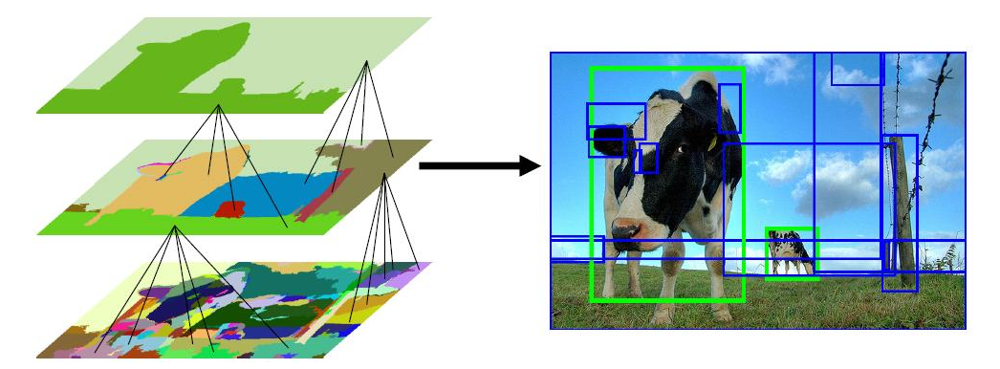

# Pertemuan 2
- Intro to Object Detection Algorithm
- Basic concept R-CNN, Fast R-CNN & Faster R-CNN
- Tensorflow Object detection Inferencing Faster R-CNN
    - OpenCV DNN
    - Tensorflow 2.0

___
# 1. Intro to Object Detection Algorithm
- Object detection is the task of `detecting instances` of objects of a certain class within an image. ([paperswithcode.com](https://paperswithcode.com/task/object-detection))

- The state-of-the-art methods can be categorized into two main types: one-stage methods and two stage-methods. 
    - `One-stage methods` prioritize inference `speed`, and example models include `YOLO`, `SSD` and `RetinaNet`. 
    - `Two-stage methods` prioritize detection `accuracy`, and example models include `Faster R-CNN`, `Mask R-CNN` and `Cascade R-CNN`.
- `Object Detection` VS `Image Classification` :
    - `Image Clasification` : classify an image into a certain category. 
    - `Object Detection` : Identify the `location` of objects in an image.
    
    - If you want to classify an image into a certain category, it could happen that the object or the characteristics that are required to perform categorisation are `too small` with respect to the `full image`. 
    
    - In that case, you would achieve better performance with object detection instead of image classification.

## 1.1 General Object Detection Framework
- Three steps in an object detection framework :
    - Generate `regions of interest` or `region proposals`. 
    - Produce `visual feature extraction` and evaluate which objects are present for each visual features.
    - Overlapping boxes are combined into a single bounding box (`non-maximum suppression`)


### 1.1.1 Region proposals
- Brute-force approaches
    - These brute-force approaches are similar to a `sliding window` that is applied to the image, over several ratios and scales. <br>

    - classifier use all region produced by sliding window, 

- Selective Search
    - A `clustering based approach` which attempts to group pixels and generate proposals based on the generated clusters.
    - Grouped pixel based on linear combination of `Color`, `Texture`, `Size` and `Shape` Similarity.

    - Selective Search segmenting & merging at multiple scale,



### 1.1.2 Feature Extraction
- Feature extraction is to reduce a variable sized image to a fixed set of visual features. 
- In object detection frameworks, people typically use `pretrained image classification` models to `extract visual features`, as these tend to generalise fairly well.
- This part also known as `Backbone Network`. 


### 1.1.3 Non-maximum Suppression
- Idea of non-maximum suppression is to `reduce` the number of `detections` in a frame to the actual number of objects present.


## 1.2 Evaluation metric
- The most common evaluation metric is **mAP** (`mean average precision`) in Object detection (localisation and classification).
- mAP is the average of **AP** (`average precision`).
- Average Precision (AP) is finding the area `under` the `precision-recall` curve.
- How to calculate mAP ?
    - For each bounding box, measure an `overlap` between the `predicted` bounding box and the `ground truth` bounding box. 
    - This is measured by **IoU** (`intersection over union`).
    
    - Find True Positive (TF) and False Positive (FP) by applying some threshold (usually `0.5`).
    - For example, 
        - if IoU value for a prediction is `0.7`, then we classify it as `True Positive (TF)`. 
        - On the other hand, if IoU is `0.3`, we classify it as `False Positive (FP)`.
        
    - calculate Precision & Recall for each class
     
    - plot precision & recall and calculate area under precision-recall curve for each class,
    
        - Example, the areas of the three trapezoids 1, 2, 3 are 0.335, 0.15875, and 0.1375. Total is 0.63125.
    - calculate mAP by averaging all AP result for each class.


___
# 2. Basic concept R-CNN, Fast R-CNN & Faster R-CNN
## 2.1 Region-based CNN (R-CNN)
- R-CNN which was introduced in `November 2013` by `Ross Girshick` et al.
- **Regions** : ~2000 Selective Search proposals
- **Feature Extractor** : `AlexNet` pre-trained on `ImageNet`, fine-tunned PASCAL 2007
- Use `Bounding box regression` to refine box location,
- `Performance`: mAP of 53.7% on PASCAL 2007

- Pros :
    - Accurate
    - Any architecture can be used as a feature 
extractor (VGG, AlexNet, DenseNet, etc.)
- Cons :
    - `Hard to train` (lots of training objectives: 
softmax classi̎ier, linear SVMs, bound-box 
regressions, lot of them train separately)
    - `Slow training` (`84h` on GPU)
    - `Inference` (detection) `is slow` (47s / image with VGG-16 feature extractor)

## 2.2 Fast R-CNN
- R-CNN is slow because it performs a ConvNet forward
pass for each object proposal, without sharing computation.
- Fast R-CNN method computes a `convolutional feature map` for the `entire input image` and then classifies each object proposal using a feature vector extracted from the shared feature map.
- Fast R-CNN was introduced in `April 2015` by `Ross Girshick` et al.
- Trains R-CNN with `VGG16` network is `8.8x` faster than R-CNN.
- `146x` faster at test-time (~ 0.32s).
- Achieves a higher mAP on PASCAL VOC 2007 with a mAP of `66.9%`.


## 2.3 Faster R-CNN
- Region proposal computation is a `bottleneck` in Fast R-CNN.
- Faster R-CNN using `Region Proposal Network (RPN)` as region proposal which shares full-image `convolutional features` with the `detection network`.
- Faster R-CNN  is composed of two modules. The first module is a `Region Proposal Network (RPN)` and the second module is the `Fast R-CNN` detector.
- `250x` faster at test-time (~ 0.2s).
- Achieves a higher mAP on PASCAL VOC 2007 with a mAP of `69.9%`.

___

# 3. Faster R-CNN Inferencing
## 3.1 Prerequisites
- Install Jupyter in Jetson Nano
```
sudo apt install nodejs npm
sudo pip3 install jupyter
```
- Install **Tensorflow GPU**, follow this tutorial on medium. <br>[9. Install & Test Tensorflow 2.x GPU di Jetson Nano](https://yunusmuhammad007.medium.com/9-install-test-tensorflow-2-x-gpu-di-jetson-nano-8bb45f5235e3?source=rss-e686f9889fc0------2)
- Install **OpenCV CUDA enable**, follow this tutorial on medium. <br>[8. Tiny Yolo V3 Inferencing menggunakan OpenCV DNN dengan CUDA Enable di Jetson Nano](https://yunusmuhammad007.medium.com/8-tiny-yolo-v3-inferencing-menggunakan-opencv-dnn-dengan-cuda-enable-di-jetson-nano-990b84e95faa)

___
## 3.2 Tensorflow Faster R-CNN model Inferencing Using OpenCV DNN

- To use OpenCV DNN with Backend CUDA for Inferencing Tensorflow model, we need to prepare `frozen optimized for inference graph` in bynary (.pb) and text format (.pbtxt)
    ```
    cv2.dnn.readNetFromTensorflow('model.pb', 'model.pbtxt')
    ```
- For now, we just use pre-trained `faster R-CNN` models with backbone `ResNet-50` on `COCO` dataset.
    - Weight : [[faster_rcnn_resnet50_coco_2018_01_28.tar.gz](http://download.tensorflow.org/models/object_detection/faster_rcnn_resnet50_coco_2018_01_28.tar.gz)]
    - Config : [[faster_rcnn_resnet50_coco_2018_01_28.pbtxt](https://raw.githubusercontent.com/opencv/opencv_extra/master/testdata/dnn/faster_rcnn_resnet50_coco_2018_01_28.pbtxt)]
- Extract `faster_rcnn_resnet50_coco_2018_01_28.tar.gz` and copy `frozen_inference_graph.pb` to `model/` directory in this tutorial  (inside jetson nano).
- Next, copy `faster_rcnn_resnet50_coco_2018_01_28.pbtxt` to `model/` directory as before.
- Open `faster_r-cnn_opencv_dnn.ipynb` in this tutorial using VS Code (inside jetson nano).
___
## 3.3 Tensorflow Faster R-CNN model Inferencing in Tensorflow 2.0
- Extract `faster_rcnn_resnet50_coco_2018_01_28.tar.gz` and copy `saved_model` folder to `model/` directory in this tutorial (inside jetson nano).
- Open `faster_r-cnn_tensorflow.ipynb` in this tutorial using VS Code (inside jetson nano).

___
## TIPS!
### 1. Free up memory by disabling GUI
- To disable GUI on boot, run:

    ```
    sudo systemctl set-default multi-user.target
    ```

- To enable GUI again, run:
    ```
    sudo systemctl set-default graphical.target
    ```

# Source
- https://www.datacamp.com/community/tutorials/object-detection-guide
- https://www.pyimagesearch.com/2020/06/29/opencv-selective-search-for-object-detection/
- https://arxiv.org/abs/1504.08083
- https://arxiv.org/pdf/1506.01497.pdf
- https://towardsdatascience.com/map-mean-average-precision-might-confuse-you-5956f1bfa9e2#:~:text=mAP%20(mean%20average%20precision)%20is,difference%20between%20AP%20and%20mAP.
- https://classeval.wordpress.com/introduction/introduction-to-the-precision-recall-plot/
- https://jeanvitor.com/tensorflow-object-detecion-opencv/
- https://github.com/opencv/opencv/wiki/TensorFlow-Object-Detection-API
