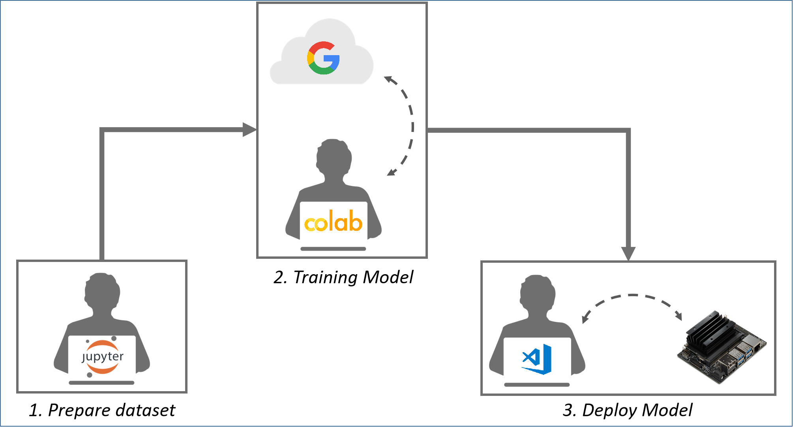
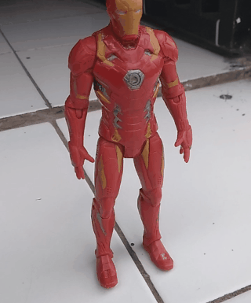
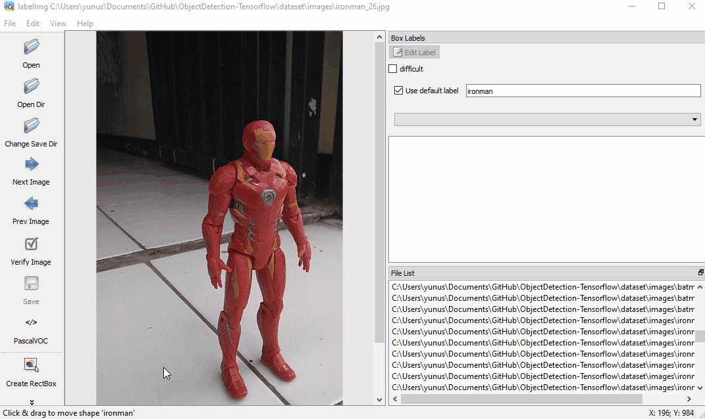
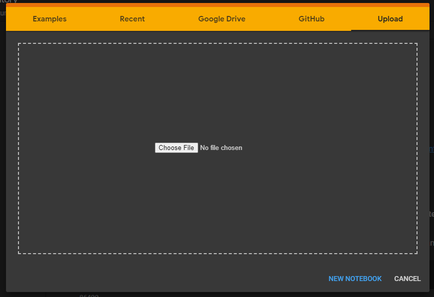
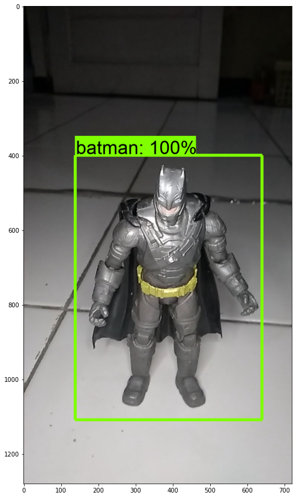
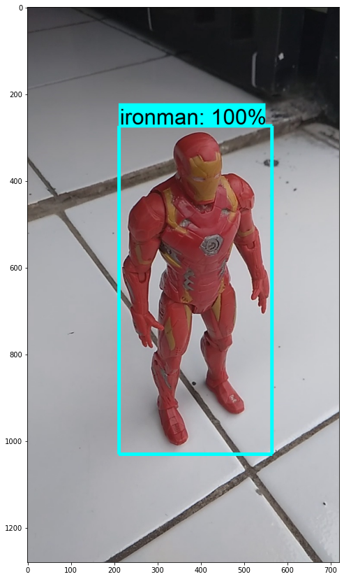
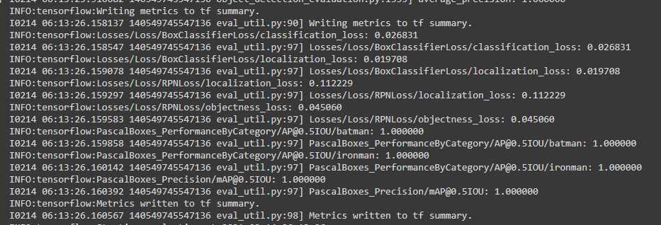

# Pertemuan 3
- Prepare Dataset
    - Convert Video to Image dataset
    - Annotate Image Dataset using `LabelImg`
    - Split dataset
- Training Tensorflow model Faster R-CNN Inception V2 in Google Colab
- Deploy model to Jetson Nano <br>

____
# 1. Prepare Dataset
- Take a video for the object to be detected. `One video` for `one data class`.<br>

- Clone [ObjectDetection-Tensorflow](https://github.com/Muhammad-Yunus/ObjectDetection-Tensorflow) repository from Github,
- Convert Video to Image using `dataset_builder.ipynb` in cloned `ObjectDetection-Tensorflow` repo.
- Download & Install [LabelImg](https://github.com/tzutalin/labelImg) 
- Annotate Dataset using LabelImg, <br>

- Split dataset (20% for test dataset, 80% for training dataset) using `dataset_builder.ipynb` in cloned `ObjectDetection-Tensorflow` repo.
___
# 2. Training Tensorflow model Faster R-CNN Inception V2 in Google Colab
- Open [Google Colab](https://colab.research.google.com/notebooks/intro.ipynb#recent=true)
- Upload `Faster_R_CNN_Training_using_Custom_Dataset.ipynb` in cloned `ObjectDetection-Tensorflow` repo to Colab.

- Follow the step in uploaded notebook 
- Download `inference_graph.zip` from colab to local computer
- Detection Result : <br>
    <p float="left">
    
     
    </p>
- Evaluation report :
    - mAP : 100% (0.5IOU)
    
___
# 3. Deploy model to Jetson Nano
- extract `inference_graph.zip` in local computer
- copy `frozen_inference_graph.pb` and `faster_rcnn_inception_v2_custom_dataset.pbtxt` from extracted `inference_graph.zip` folder to  `pertemuan_3/model/` folder in Jetson Nano.
- copy `object-detection.json` file created in step one (prepare dataset - [ObjectDetection-Tensorflow](https://github.com/Muhammad-Yunus/ObjectDetection-Tensorflow)) to `pertemuan_3/` folder in Jetson Nano.
- run `faster_r-cnn_flask_async.py`,
    ```
    python3 faster_r-cnn_flask_async.py
    ```
- open result in browser (local computer) with url `http://<jetson nano IP>:5000`
- Result,<br>

___