# Pertemuan 4
- Intro to Object Detection Using Yolo
- Training Darknet Yolo Model using Custom Dataset
- Deploy Model to Jetson Nano & run using OpenCV DNN<br>

___
# 1. Intro to Object Detection Using Yolo
## 1.1 YOLOv1
- `Yolo (You Only Look Once)` V1 was introduced in June 2015 by `Joseph Redmon` et al.
- Creators of YOLO were motivated to design a `single stage CNN` that could be `trained end to end`, was easy to `optimize` and was `real-time`.
- Compare to R-CNN based object detection, the network was `hard to optimize` as well as `slow`. 
- `Yolo` Conceptual Design :
    - Yolo divides the image into an ***S × S*** grid
    - For each grid cell predicts ***B***  `bounding boxes` (*x, y, w, h*) with `confidence` for those boxes, and `class probabilities` (***C***). 
    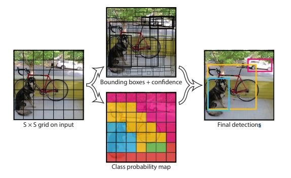
    - These predictions are encoded as an
    ***S × S × (B ∗ 5 + C)*** tensor. 
    - General design Yolo architecture :<br>
    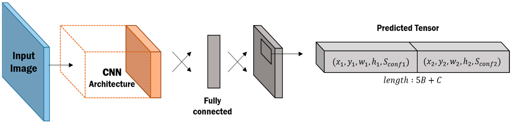
    - YOLO on PASCAL VOC, use S = 7, B = 2. with 20 labelled classes (C = 20). Produce tensor with size 7 × 7 × 30.
    
- `YOLOv1` Architecture :<br>
    - Network architecture is inspired by the `GoogLeNet` as a network backbone (feature extractor). 
    - Detection network has `24 convolutional layers` followed by `2 fully connected layers`.
    - The final output of our network is the 7 × 7 × 30 tensor of predictions.
    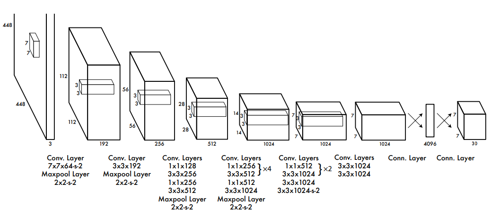
- VOC 2007 `Error Analysis` for `Yolo` vs `Fast R-CNN`,
    - `Correct` : correct class and IOU > 0.5
    - `Localization` : correct class, 0.1 < IOU < 0.5
    - `Similar` : class is similar, IOU > 0.1
    - `Other` : class is wrong, IOU > 0.1
    - `Background` : IOU < 0.1 for any object
    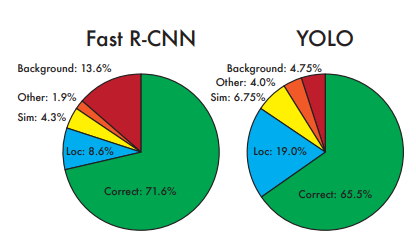
- Pros: 
    - Quite `fast` (`~40 FPS` on Nvidia Titan Black)
    - `End-to-end training`
    - `Low Error Rate` for Foreground/ Background misclassification
    - Learn very `general representation` of objects
- Cons: 
    - `Less accurate` than Fast R-CNN (63.9% mAP compare to 66.9%)
    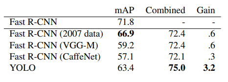
    - Can not detect `small objects` 
    - `Low detection rate` of objects that located `close` to each other
## 1.2 YOLOv2 (YOLO9000)
- YOLOv2 or `YOLO9000` was introduced at the end of 2016 by `Joseph Redmon` et al.
- YOLOv2 uses `Darknet 19 architecture` as a backbone with `19 convolutional layers` and `5 max pooling layers` and `a softmax layer` for classification objects. 
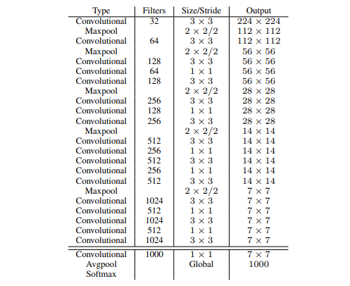
- Inference Speed on Pascal VOC 2007 :
    - At 67 FPS, gets 76.8 mAP 
    - At 40 FPS, gets 78.6 mAP<br>
    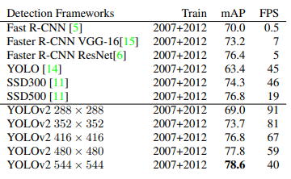
- Outperforming state-of-the-art methods like Faster RCNN with ResNet and SSD. 
- Compare to YOLOv1, YOLOv2 becomes `better` (less error rate), `faster` (higher FPS) and `stronger`(9000 object categories with high detection and classification result).
## 1.3 YOLOv3 
- YOLOv3 was introduced in April 2018 by `Joseph Redmon` et al.
- YOLOv3 uses `Darknet 53 architecture` as a backbone with `53 convolutional layers`.
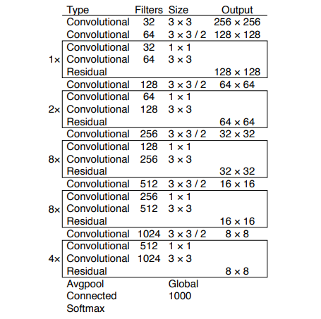
- `Darknet 53 architecture` is a `hybrid approach` between the network used in YOLOv2 (`Darknet-19`) and `residual network (ResNet)`.
- `Darknet 53` built with `consecutive` 3x3 and 1x1 convolution layers followed by a `skip connection` (introduced by `ResNet` to help the `activations propagate` through deeper layers without `gradient diminishing`).
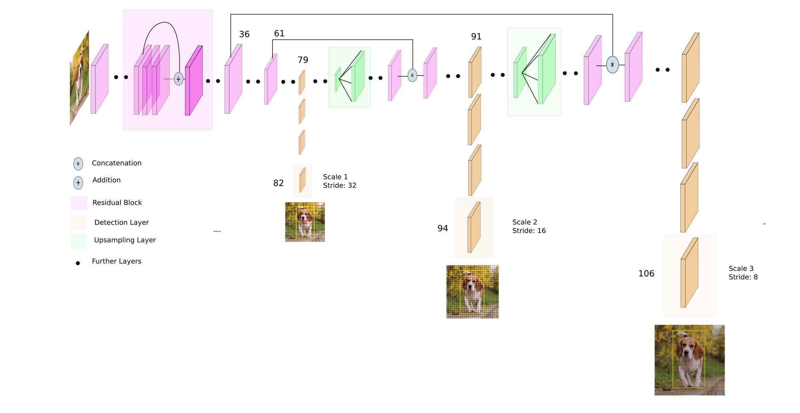
- YOLOv3 predicts boxes at `3 different scales`. 
- Extracts features from those scales using a similar concept to `Feature Pyramid Networks (FPN)`.
- Taking the feature map from 2 layers `previous` and `upsample` it by 2x. 
- Also take a feature map from `earlier`
in the network and `merge` it with our `upsampled features` using `concatenation`. 
- This method `improve` network ability for detecting `small object`. 
- Detection tensor is ***N × N × [3 ∗ (4 + 1 + 80)]***, for the 4 bounding box offsets, 1 objectness prediction, and 80 class predictions. <br><br>
- Inference Speed :
    - At 320 × 320 runs in `22 ms` at `51.5 mAP-50` using COCO metric, as accurate as SSD but three times faster.
    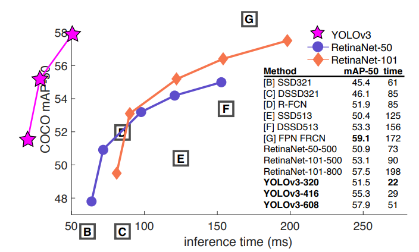
    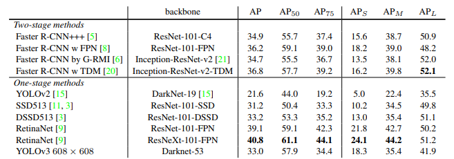
- YOLOv3 is a good detector. It’s `fast` and `accurate`. 
- YOLOv3 is the last reseach by `Joseph Redmon` before he quite research on AI Computer Vision.
## 1.4 Yolo V4
- Yolo V4 was introduced in April 2020 by `Alexey Bochkovskiy` et al.
- But for now we won't get into this YOLO version.
## 1.5 Summary Object Detection 
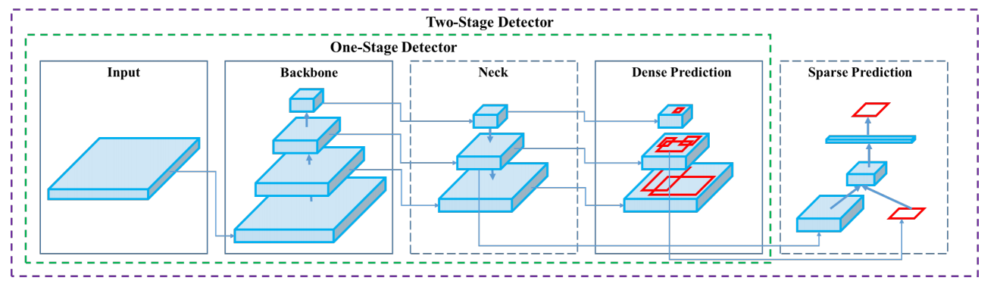
- `Input` : Image
- `Backbones` : VGG16, ResNet-50, DarkNet-53, etc.
- `Neck` : SPP, FPN, PAN, BiFPN, etc.
- `Heads` :
    - `Dense Prediction` (one-stage) : RPN , SSD, YOLO, RetinaNet, etc.
    - `Sparse Prediction` (two-stage) : Faster R-CNN, Mask R-CNN, etc.
___
# 2. Prepare Dataset
- Take a video for the object to be detected. `One video` for `one data class`.
- Clone [ObjectDetection-Yolo](https://github.com/Muhammad-Yunus/ObjectDetection-Yolo) repository from Github to local computer,
- Open cloned `ObjectDetection-Yolo` repo folder.
- Follow instruction step by executing script in `dataset_builder.ipynb`

___
# 3. Training Darknet Yolo Model using Custom Dataset
- Open [Google Colab](https://colab.research.google.com/notebooks/intro.ipynb#recent=true) in local computer browser.
- Upload `Training Darknet - Yolo using Custom Dataset.ipynb` from cloned `ObjectDetection-Yolo` repo to Colab.
- Follow training step in uploaded notebook, 
- After training & testing finish, download `yolo_model.zip` from colab to local computer,
___
# 4. Deploy Model to Jetson Nano
- Extract `yolo_model.zip` in local computer
- Copy `yolov3-tiny-custom.weights` and `yolov3-tiny.cfg` from extracted `yolo_model.zip` folder to  `pertemuan_4/model/` folder in Jetson Nano.
- Copy `object-detection.json` file created in step one (prepare dataset - [ObjectDetection-Yolo](https://github.com/Muhammad-Yunus/ObjectDetection-Yolo)) to `pertemuan_4/` folder in Jetson Nano.
- Run `yolo-inferencing-opencv-dnn.py`,
    ```
    python3 yolo-inferencing-opencv-dnn.py
    ```
- Open result in browser (local computer) with url `http://<jetson nano IP>:5000`
___
# Source
- YOLOv1 (https://arxiv.org/pdf/1506.02640.pdf)
- YOLOv2 - YOLO9000 (https://arxiv.org/pdf/1612.08242.pdf)
- YOLOv3 (https://arxiv.org/abs/1804.02767)
- Yolo V4 (https://arxiv.org/pdf/2004.10934.pdf)
- https://www.slideshare.net/fwdays/faster-than-realtime-face-detection?from_action=save
- https://towardsdatascience.com/evolution-of-yolo-yolo-version-1-afb8af302bd2
- https://www.researchgate.net/figure/YOLOv2-architecture-YOLOv2-architecture-is-modified-with-our-new-assisted-excitation_fig3_333609719
- https://medium.com/@arashilen/note-for-yolov3-3e867c0ceca9#:~:text=YOLO%20was%20struggling%20on%20detecting,boxes%20at%203%20different%20scales.