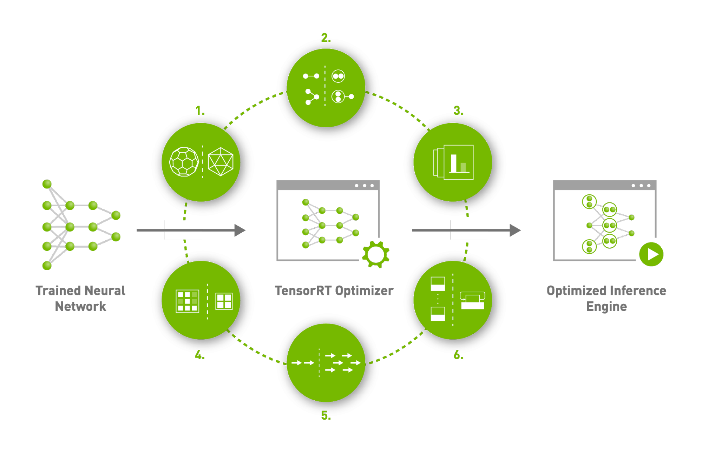
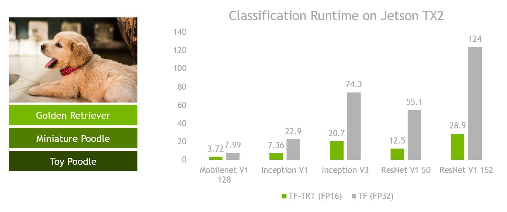
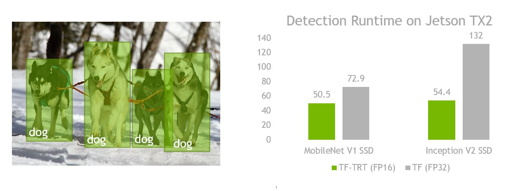
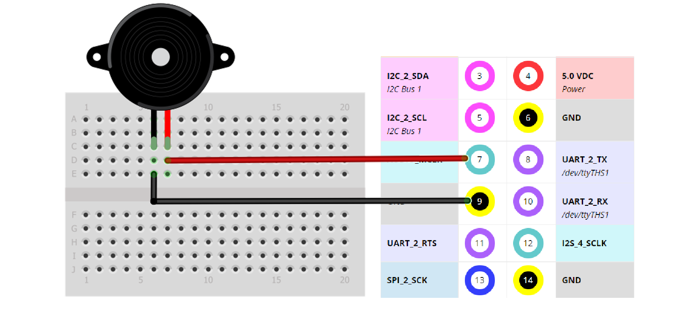

# Pertemuan 5
- Tensorflow Object Detection Optimize Graph For Inference OpenCV DNN
- Tensorflow Object Detection Optimize Graph For Inference TensorRT
- Object Counting :
    - Counting by Area
    - Crossing Line
___
# Tensorflow Object Detection Optimize Graph For Inference OpenCV DNN
- Open [Google Colab](https://colab.research.google.com/notebooks/intro.ipynb#upload=true),
- Upload `Tensorflow_OpenCV_DNN_(Optimize_Graph_For_Inference).ipynb` to Colab,
- Follow instruction in uploaded notebook,
- Download & Extract `inference_graph.zip` to local computer from colab,
- Copy folder `tf_models/` and `graph_text/` inside extracted folder `inference_graph/` to Jetson Nano `pertemuan_5/`.
- Run Inference Model :
    - Object Locatization (Faster R-CNN, SSD) :
    ```
    python3 fater_rcnn_flask_async.py
    ```
    - Object Segmentation (Mask R-CNN):
    ```
    python3 mask_rcnn_flask_async.py
    ```
___
# TensorRT
- **NVIDIA® TensorRT™** is an SDK for `high-performance` deep learning `inference`. 
- It includes a deep learning `inference optimizer` and runtime that delivers `low latency` and `high throughput` for deep learning inference applications.
    
- TensorRT-based applications perform up to `40X faster` than `CPU-only` platforms during inference.
- TensorRT is built on CUDA®, NVIDIA’s parallel programming model.
- More Detail [TensorRT](https://developer.nvidia.com/tensorrt)
___
# Tensorflow integration with TensorRT (TF-TRT)
- **TensorFlow™ integration with TensorRT™ (TF-TRT)** optimizes and executes `compatible subgraphs`, allowing TensorFlow to execute the remaining graph.
- TF-TRT is part of the TensorFlow binary, which means when you install tensorflow-gpu, you will be able to use TF-TRT too.
- The model that TF-TRT optimizes can have the graph or parameters stored in `float32 (FP32)` or `float16 (FP16)`. 
- TensorRT able to set precisions lower than `FP32`, meaning `FP16` and `INT8`, it would `improve the performance of inference`. 

- The `FP16 mode` uses Tensor Cores or `half precision hardware instructions`, if possible. 
- Tensorflow Workflow :<br>

- TF - TRT Workflow from Saved Model : <br>

- TF-TRT Workflow  from frozen graph :<br>

- Benchmark :
    - Image Classification : <br>
    
    - Object Detection :<br>
    
    - Note :
        - Tested in Jetson Nano TX2
        - `TF` - Original TensorFlow graph (`FP32`)
        - `TF-TRT` - TensorRT optimized graph (`FP16`)
___
# Tensorflow - TensorRT Optimize Inference Graph (TF-TRT))
- Open [Google Colab](https://colab.research.google.com/notebooks/intro.ipynb#upload=true),
- Upload `TF_TRT_Tensorflow_1_15.ipynb` to Colab,
- Follow instruction in uploaded notebook,
- Download & Extract `tf_trt_graph.zip` to local computer from colab,
- Copy folder `tf-trt-graph/` inside extracted folder `tf_trt_graph/` to Jetson Nano `pertemuan_5/`.
- Install Tensorflow v1.15 in Jetson Nano (Jetpack 4.5):
    ```
    sudo pip3 install --pre --extra-index-url https://developer.download.nvidia.com/compute/redist/jp/v45 'tensorflow<2'
    ```
- Run  Tensorflow - TensorRT Optimized Inference Graph (TF-TRT) :
    ```
    python3 tf_trt_flask_async.py
    ```
- The `"loading time"` and the `"preparation time"` for the `1st inference` after boot by the converted tensorRT model is `notoriously long`. It takes `4~5 minutes` to load a model at less than 100MB.
- Related issue [issues:56](https://github.com/tensorflow/tensorrt/issues/56)
___
# Object Counting
- Object Counting `object_counting_flask_async.py` has two mode operation :
    - counter area : `Counter(classes, mode='area'`, detect number of object in current frame.
    - counter crossing line : `Counter(classes, mode='line'`, detect number of object crossing the line `counter.line` .
        - Counter is increasing if `x,y` box object with the line less than distance threshold `threshDist=50` (distance `r=sqrt(x^2 + y^2)`).
- Object Counting `object_counting_flask_async.py` will trigger `buzzer` to play `beep...` if counter is increasing.
- Wiring diagram `buzzer`, using **pin 7**.<br>

- run `object_counting_flask_async.py` in Jetson Nano,
    ```
    python3 object_counting_flask_async.py
    ```
- Counter result 'line' : <br>
    

___
# Source
- https://github.com/NVIDIA-AI-IOT/tf_trt_models#od_notebook
- https://docs.nvidia.com/deeplearning/frameworks/tf-trt-user-guide/index.html