# Pertemuan 6
- Camera Architecture Stack
- Gstreamer
- Image Stithing
- Inference OpenCV DNN using two camera

___
# 1. Camera Architecture Stack
- The NVIDIA camera software architecture includes NVIDIA components for ease of development and customization:
    - *Fig.1. Diagram from Development Guide for NVIDIA Tegra Linux Driver Package (31.1 Release, Nov.2018)*
    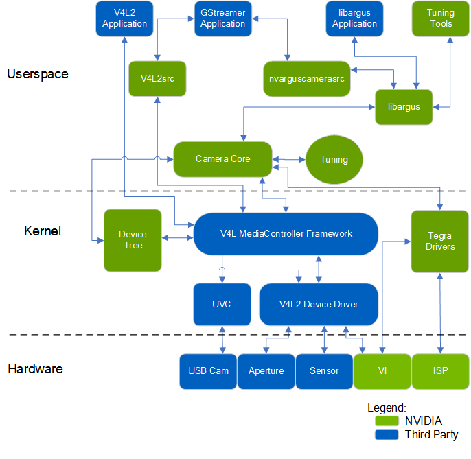
- NVIDIA Components of the camera architecture :
    - **libargus** - provides low-level API based on the camera core stack - Jetson ISP (CSI Interface).
    - **nvarguscamerasrc** - NVIDIA camera **GStreamer** plugin that provides options to control ISP (Image Signal Processor) properties using the ARGUS API
    - **v4l2src** - standard Linux V4L2 (Video4Linux) application that uses direct kernel IOCTL calls to access V4L2 functionality.
___
# 2. Gstreamer
- GStreamer is open source multimedia framework to capture, transform and display multimedia data (image, video).
- GStreamer application communicate with `V4L2` or `Argus API` to control camera device. 
- The most basic part of GStreamer is that we’re building `pipelines`.
- A `pipeline` is describing a flow of operations that start from a source, goes through some operations we wish all along the way to the destination of it.
- Pipeline element :
    - `Source element` : file source or camera source. 
    - `Manipulation element` : filter, converter, codec, decoder, and more.
    - `Destination(Sink) element` : This actually describes what will happen with the data at the end of the pipeline.
- Pipeline element is sparated by aclamation sign (`!`).
    ```
    <element> ! <element> ! <element>
    ```
- Jetson Nano `GStreamer Accelerated Elements` :

    <table>
    <tbody><tr>
    <th>Element
    </th>
    <th>Description
    </th></tr>
    <tr>
    <td>`nvarguscamerasrc`
    </td>
    <td>Source element Camera plugin for ARGUS API
    </td></tr>
    <tr>
    <td>`nvidconv`
    </td>
    <td>Video format conversion & scaling
    </td></tr>
    <tr>
    <td>`nvcompositor`
    </td>
    <td>Video compositor
    </td></tr>
    <tr>
    <td>`nvvideosink`
    </td>
    <td>Video Sink Component. Accepts YUV-I420 format and
    produces EGLStream (RGBA)
    </td></tr>
    <tr>
    <td>`nveglstreamsrc`
    </td>
    <td>Acts as GStreamer Source Component, accepts
    EGLStream from EGLStream producer
    </td></tr>
    <tr>
    <td>`nvegltransform`
    </td>
    <td>Video transform element for NVMM to EGLimage
    (supported with nveglglessink only)
    </td></tr>
    </tbody></table>

- More details about [NVIDIA GStreamer Element](https://developer.download.nvidia.com/embedded/L4T/r32_Release_v1.0/Docs/Accelerated_GStreamer_User_Guide.pdf?WfxYkTYup81ZY9n-lN8r8HQh6ws5H0Eytq8bDYD6SyUce-nsYhlceY9MGEmdugllXUkEyDYVMQogzVmxlwl3Eeka1cB8wTcs1UdYNZ-4_4DeKUv85DyR7hCyne9SFdxFkg-3QmkWe0DoDXvLeFHdzVuvBsXYVTbD3sYoGwBweSERhOJgv2c).
- To run GStreamer pipeline we can use `gst-launch-1.0` command :
    ```
    gst-launch-1.0 [OPTIONS] PIPELINE-DESCRIPTION
    ```
- Basic GStreamer pipeline to stream camera as video,
    ```
    gst-launch-1.0 nvarguscamerasrc sensor_id=0 ! 'video/x-raw(memory:NVMM), width=3280, height=2464, format=NV12, framerate=21/1' ! nvvidconv flip-method=2 ! 'video/x-raw,format=BGRx' ! nveglglessink
    ```
    - `nvarguscamerasrc sensor_id=0` is source element, using `argus` plugin for gstreamer. `sensor_id=0` to access camera with `id=0`, 
    - `'video/x-raw(memory:NVMM), width=3280, height=2464, format=NV12, framerate=30/1'` is manipulation element called **CAPS** (capabillity) contain video raw, size, format, framerate and other related video properties.
    - `nvvidconv flip-method=2` is manipulation element to change format and size video stream to `'video/x-raw,format=BGRx'` and flip video output vertically `flip-method=2`.
    - `nveglglessink` is a sink element. 
- Video result,
    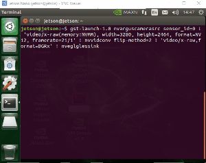
- If Gstreamer error when running command above, try to restart Argus API,
    ```
    sudo service nvargus-daemon restart
    ```
- Gstreamer - OpenCV Integration
    - GStreamer pipeline is accessible via Opencv `cv2.VideoCapture()`.
    - Use `camera(i, w, h)` function in `gst_cam.py` to simplify OpenCV - GStreamer integration. 
    - `camera(i, w, h)` function parameter :
        - `i` : camera sensor id : 0, 1, ...
        - `w` : video output width,
        - `h` : video output hight.
    - Run `opencv_gst_flask.py` to use CSI camera and display in web-browser using flask,
        ```
        python3 opencv_gst_flask.py
        ```
    - Run `opencv_gst_flask_2cam.py` to use 2 CSI camera and display in web-browser using flask,
        ```
        python3 opencv_gst_flask_2cam.py
        ```
    - Video result,
    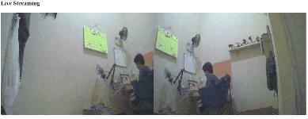
___
# 3. OpenCV Image Stitcing
- The stitching module pipeline implemented in the Stitcher class OpenCV :
    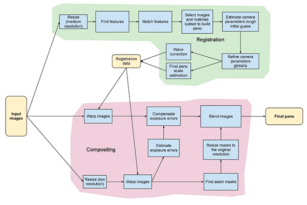
- This method is similar to the method proposed by `Brown` and `Lowe` in their 2007 paper, `Automatic Panoramic Image Stitching with Invariant Features`.
- the `Brown and Lowe method` is insensitive to :
    - Ordering of images
    - Orientation of images
    - Illumination changes
    - Noisy images that are not actually part of the panorama
- Original publication [link](http://matthewalunbrown.com/papers/ijcv2007.pdf).
- OpenCV image stitching method :
    - `cv2.Stitcher(try_use_gpu=False)` : define stitching object with `try_use_gpu` (bool) to enable use GPU acceleration. 
    - `cv2.Stitcher.create(mode)` : create sticher object.
    - `mode` option :
        - `cv2.Stitcher_PANORAMA`
        - `cv2.Stitcher_SCANS`
    - output :
        - `retval` : (bool)
            - 0 : `OK`
            - 1 : `ERR_NEED_MORE_IMGS`
            - 2 : `ERR_HOMOGRAPHY_EST_FAIL`
            - 3 : `ERR_CAMERA_PARAMS_ADJUST_FAIL`
        - `image panorama` : (ndarray)
- Run `opencv_stitching_flask.py` ,
    ```
    python3 opencv_stitching_flask.py
    ```
- Video result,
    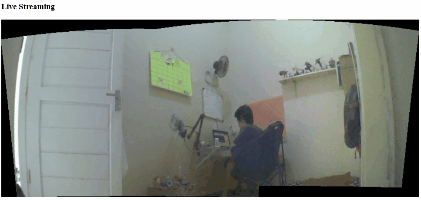
- Modifying output stitching to remove black spot in stiched image.
    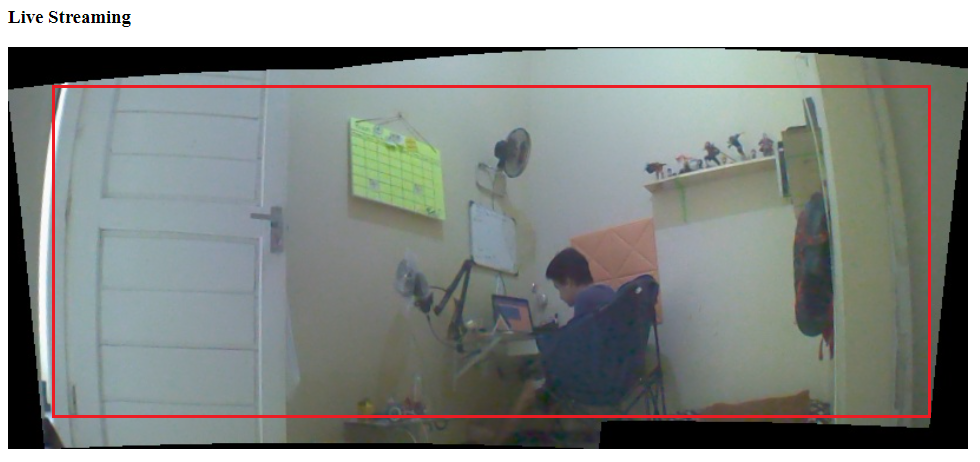
    - Create mask (black and white) image from stitched image,
        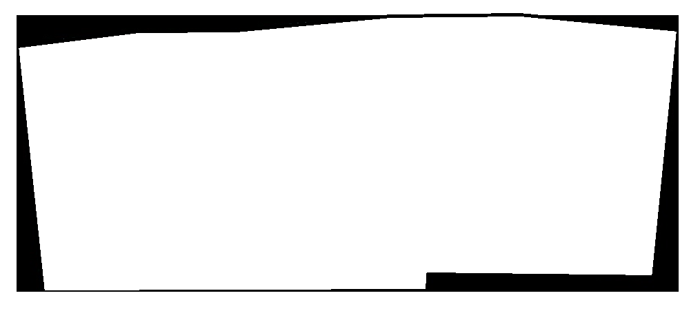
    - Find minimum area rectangle in mask image with non zero value array.
    - Crop stiched image based on that minimum area.
    - all this step is handled by `crop_border(stitched)` funtion inside `opencv_stitching_flask_v2.py`.
- Run `opencv_stitching_flask_v2.py` ,
    ```
    python3 opencv_stitching_flask_v2.py
    ```
- Video result,
    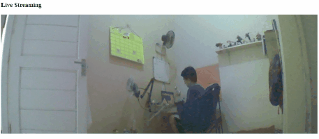
- Run `opencv_dnn_stitching_flask_async.py` to test SSD mobilenet object detection inferencing using stiched image,
    ```
    python3 opencv_dnn_stitching_flask_async.py
    ```

___
# Additional Guide
- Installing CSI Camera :

| 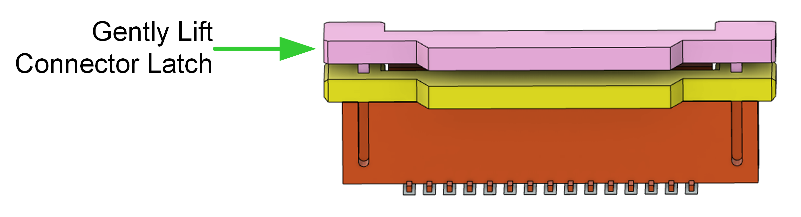  |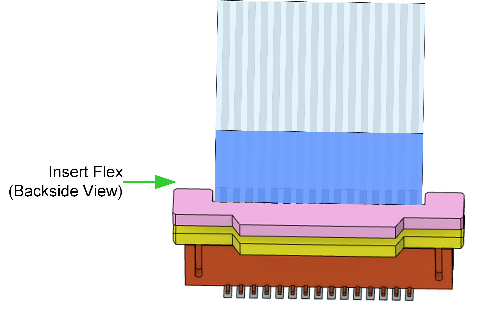    | 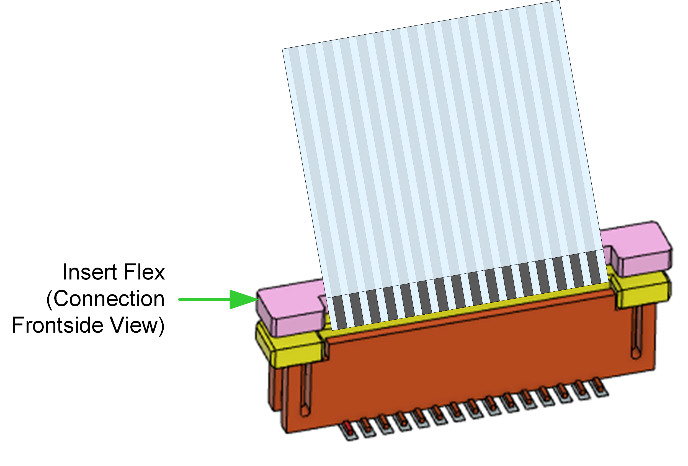   |
|---|---|---|
- Two CSI camera in Jetson Nano :
    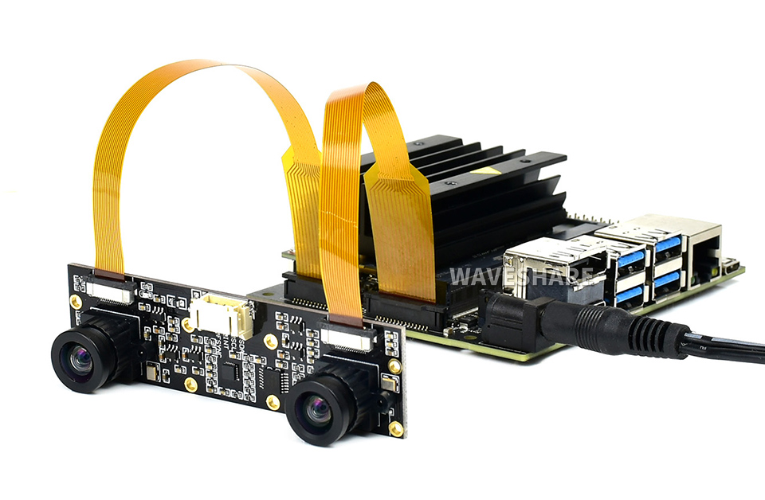

___
# Source
- https://www.fastcompression.com/blog/jetson-image-processing.htm
- https://developer.nvidia.com/embedded/learn/jetson-nano-2gb-devkit-user-guide#id-.JetsonNano2GBDeveloperKitUserGuidevbatuu_v1.0-Camera
- https://developer.nvidia.com/embedded/learn/tutorials/first-picture-csi-usb-camera
- https://idomagor.medium.com/introduction-of-gstreamer-8a513e5478d0
- https://www.pyimagesearch.com/2018/12/17/image-stitching-with-opencv-and-python/
