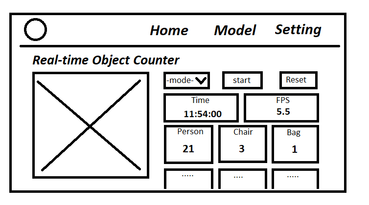
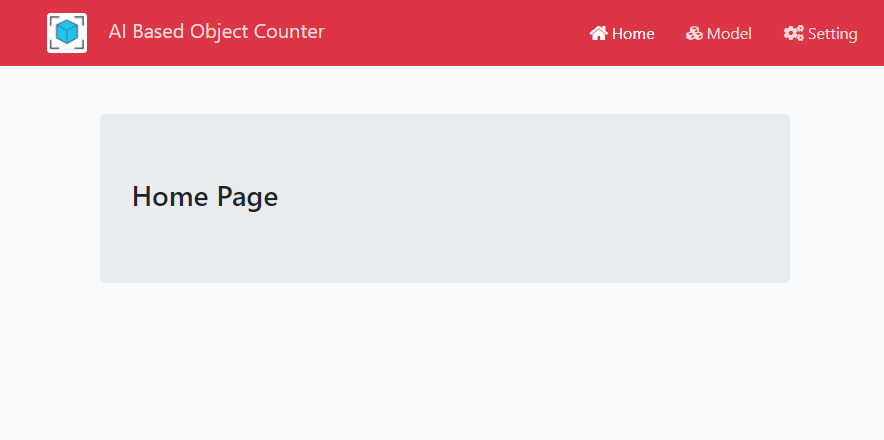
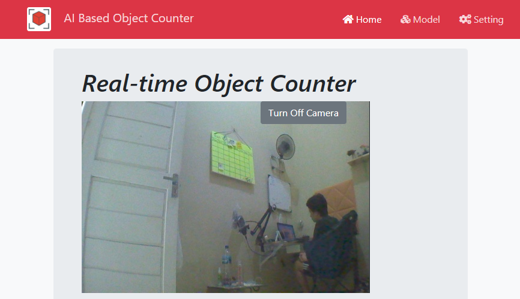
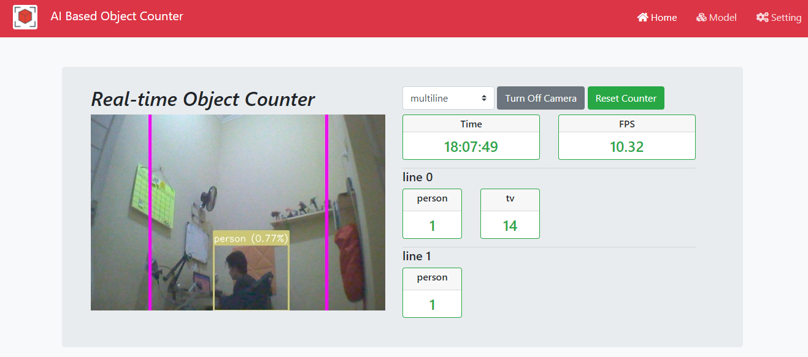

___
# Pertemuan 7

- Object Counting Crossing Area
- Base Layout Bootstrap
- Layouting - Livestream 
    - start & stop stream
    - reset counter
    - change counter mode
- Run flask app as Systemd service
___
# 1. Object Counting Crossing Area
- New mode, `multiline`
- Abble to append multiple line as counter crossing.
- just define `counter = Counter(classes, mode='multiline', lines=lines)`,
- and add multiple lien using `lines.append()` before creating `counter` object,
- Run `1_object_counter/object_counting_flask_async.py`,
    ```
    python3 1_object_counter/object_counting_flask_async.py
    ```
___
# 2. Base Layout Bootstrap
- Wireframe UI
    - Home screen :
    
- Project directory :
    - `2_base_layout/`
- Run application :
    ```
    python3 2_base_layout/app.py
    ```
- Layout : <br>
    
___
# 3. Layouting - Livestream (part 1) 
- Merge with Object Detection service
- Project directory :
    - `3_layouting_livestream/`
- Run application :
    ```
    python3 3_layouting_livestream_p1/app.py
    ```
- Layout : <br>
    
___
# 4. Layouting - Livestream (part 2)
- Add control button
- Project directory :
    - `3_layouting_livestream/`
- Run application :
    ```
    python3 4_layouting_livestream_p2/app.py
    ```
___
# 5. Layouting - Livestream (part 4)
- Add Card output
- Project directory :
    - `3_layouting_livestream/`
- Run application :
    ```
    python3 5_layouting_livestream_p3/app.py
    ```
- Layout : <br>
    

___
# 6. Run Flask App as Systemd Service
- Create systemd service with name `object-counter.service` using nano editor :
```
sudo nano /lib/systemd/system/object-counter.service
```
- Paste systemd config below,
```
[Unit]
Description=Object Counter Service
After=multi-user.target

[Service]
WorkingDirectory=<directory location of app.py>
User=<jetson nano user>
Type=idle
ExecStart=/usr/bin/python3 5_layouting_livestream_p3/app.py
Restart=always

[Install]
WantedBy=multi-user.target
```
- Change `User=<jetson nano user>` to your jetson nano user.
- Change `WorkingDirectory=<directory location of app.py>` to directory location,
- Close and save using CTRL + X followed by CTRL + Y
- Run bellow command to activate service,
```
sudo systemctl daemon-reload
sudo systemctl enable object-counter.service
sudo systemctl start object-counter.service
```
- Check Service status,
```
sudo systemctl status object-counter.service
```
- Restrat Service,
```
sudo systemctl restart object-counter.service
```
- Stop Service,
```
sudo systemctl stop object-counter.service
```